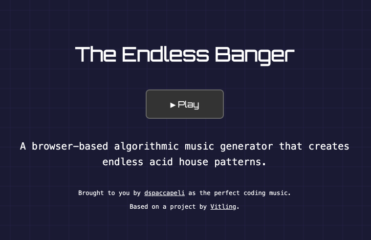

# Endless Banger

The ultimate endless algorithmic banger. The perfect background sound machine for your coding sessions and more.

Live version running [**HERE**](https://endlessbanger.com)

## Credits

I am a fan of [Endless Acid Banger](https://www.vitling.xyz/toys/acid-banger) by [Vitling](https://www.vitling.xyz). It’s my go-to soundtrack while coding.

I wanted to add a pause-and-resume feature, and while I was at it, I gave the UI a makeover, trimmed some code, and introduced a new visualizer.

To keep things simple, I also rebuilt the app in JavaScript instead of TypeScript, removing the need for build steps.

The result is a streamlined version of the original. Press Play to start the music.

The original Endless Acid Banger, which this is based on, can be found [here](https://github.com/vitling/endless-acid-banger).

## License & Intended use

I re-release this work under the same license as the original work: [Creative Commons Attribution 4.0 International License](http://creativecommons.org/licenses/by/4.0/).

Do it as you may, give credits and keep the music on.